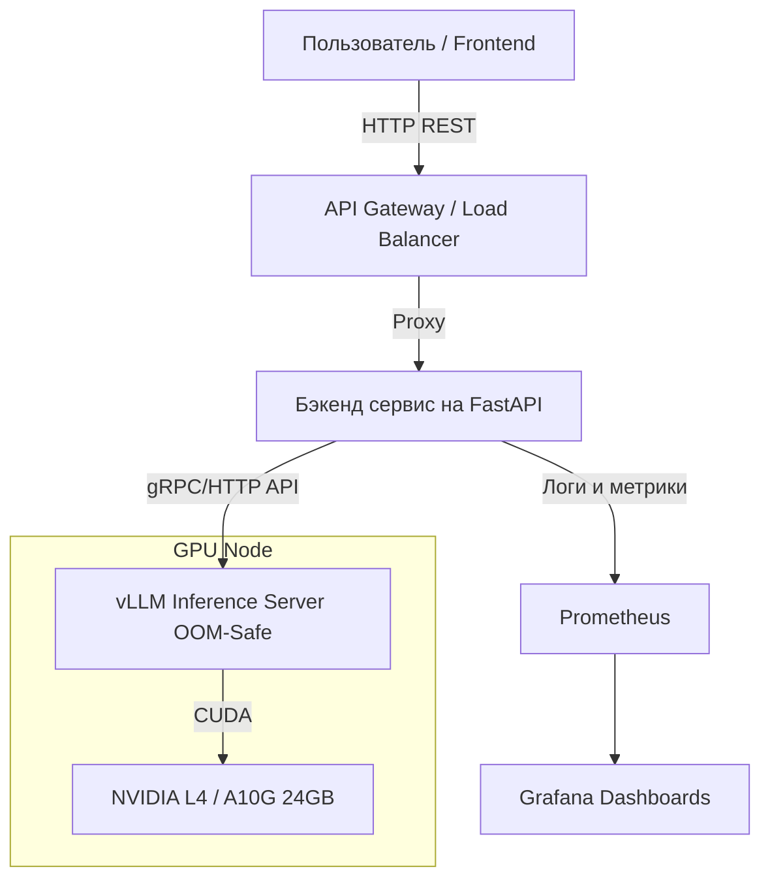

# 🚩 RedFlag AI: Детектор скрытых юридических рисков (Продолжение)

## 6. Выбор модели и эксперименты

**Обоснование выбора:**
Поскольку задача является гибридной (определение unfair-статуса, категоризация и *объяснение простым языком* (ELI5)), использование чисто экстрактивных моделей (RoBERTa, LegalBERT) не подходит — они не могут генерировать связный и понятный текст.
Для экспериментов я выбрал современные Large Language Models малого и среднего размера (7B-8B параметров), которые можно недорого дообучать (Instruction Tuning с помощью методов Parameter-Efficient Fine-Tuning — **QLoRA**) на 1-2 потребительских или серверных GPU (например, RTX 3090 / A10G):

1. **Meta-Llama-3-8B-Instruct** — SOTA модель в своем классе, отлично следует формату JSON и обладает мощной логикой.
2. **Mistral-7B-Instruct-v0.2** — Легковесная модель с огромным контекстным окном (до 32k) и хорошим балансом "качество/скорость".
3. **LegalBERT (Baseline)** — Взят в качестве классического ML-бейслайна *только* для задачи классификации (F1-score), генерация объяснений на нем невозможна.

### Эксперименты по дообучению (PEFT/QLoRA)

Для обучения использовался датасет LexGLUE (Unfair-ToS), преобразованный в формат инструкций: "Проанализируй пункт договора и верни JSON со структурой...".

| Название и характеристики модели | Время обучения (1x A10G 24GB) | Качество (Macro F1) на валидации | Метрика генерации объяснения (BERTScore) | Формат весов для инференса |
| :--- | :--- | :--- | :--- | :--- |
| **LegalBERT (Baseline, 110M)** | ~40 минут | 0.81 | N/A (не умеет генерировать) | pth (PyTorch) |
| **Mistral-7B-Instruct-v0.2 (QLoRA, 4-bit)** | ~3.5 часа | 0.86 | 0.87 | safetensors (LoRA adapters) |
| **Meta-Llama-3-8B-Instruct (QLoRA, 4-bit)** | ~4.5 часа | **0.89** | **0.91** | safetensors (LoRA adapters) |

**Победитель:** Meta-Llama-3-8B-Instruct. Она показала наилучший баланс между способностью улавливать редкие "красные флаги" (высокий F1) и качественными, не "канцелярскими" объяснениями (высокий BERTScore относительно золотых стандартов юристов).

---

## 7. Выводы по проделанной работе

**Получилось ли решить задачу?**
Да, задача выполнена успешно. Обученная модель (Llama-3-8B-Instruct-LoRA) с уверенностью детектирует грабительские условия вроде "unilateral change" (одностороннее изменение правил) и способна человеческим языком объяснить (ELI5), чем это грозит пользователю.

**С какими трудностями столкнулись и как решали:**

1. **Дисбаланс классов (Imbalanced Data):** В исходных ToS 90% пунктов — это безобидный "водянистый" текст. Дообученная LLM начала лениться и классифицировать почти все как "безопасно", чтобы собрать легкий loss.
   * *Решение:* При обучении мы перебалансировали датасет, удалив часть безопасных пунктов и добавив "hard negatives" (пункты, которые звучат грозно, но законны). Также для подсчета качества использовался строго *Macro F1-score*, а не Accuracy.
2. **Галлюцинации в "Объяснениях" (Explanations):** Иногда LLM придумывала юридические нормы из чужих юрисдикций, если текста в пункте было мало.
   * *Решение:* Снижение `temperature` до 0.1 при инференсе и строгое добавление в системный промпт правила: "Объяснение должно опираться ТОЛЬКО на текст предоставленного пункта, не выдумывай внешних законов".
3. **Ограничения окна контекста:** Договоры бывают на 50 страниц, а загонять все разом в модель — дорого и ведет к симптому "Lost in the Middle".
   * *Решение:* Разработан пайплайн (Скрипт препроцессинга), который бьет контракт на абзацы (sliding window text chunking) и отдает в модель по частям асинхронно.

---

## Часть 2. Deployment (Развертывание инференса)

### 1. Способ инференса
Выбран **Реал-тайм инференс** (с элементами асинхронного batching'а на стороне движка).
*Почему:* Юзеры (клиенты или фрилансеры) загружают договор и хотят увидеть результат сейчас (в течение 10-30 секунд), а не ждать пакетной обработки раз в сутки. Для длинных pdf-договоров используем Long-polling или WebSockets (отправка статуса по мере обработки абзацев).

### 2. Техническая составляющая инференса
*   **Протокол:** HTTP (REST API). Это стандарт де-факто для веб-сервисов и легкой интеграции с фронтендом или расширениями Chrome (которые читают ToS на лету).
*   **Формат сериализации/сохранения:** `.safetensors` — наиболее безопасный и быстрый для загрузки формат в экосистеме Hugging Face. Базовая модель + слитые LoRA-веса.
*   **Использование GPU:**
    *   **Тип:** NVIDIA L4 (24GB VRAM) или NVIDIA A10G.
    *   **Память:** Модель 8B в формате BF16 (bfloat16) занимает около 16 GB видеопамяти. Оставшиеся 8 GB идут под KV-cache (контекст).
*   **Ускорение инференса:** vLLM с PagedAttention, Continuous Batching и FlashAttention-2. Позволяет обрабатывать параллельные запросы от пользователей в десятки раз быстрее обычного HuggingFace pipeline.
*   **Фреймворки:** **vLLM** (как движок генерации), "обернутый" в **FastAPI** (для кастомных маршрутов и бизнес-логики).

### 3. Техническая записка сервиса (Tech Spec)
**Требования:**
*   *Функциональные:* Сервис принимает текст (1 абзац / пункт), валидирует длину и отдает JSON (наличие риска, категория, объяснение).
*   *Нефункциональные:* Latency на 1 абзац (до 250 токенов) < 1.5 сек. Доступность 99.9%.

**Технические характеристики:**
*   **Тип модели:** LLM (Decoder-only), архитектура Llama-3 (8B параметров).
*   **Размер контекстного окна при инференсе:** 8192 токенов (но искусственно ограничиваем входной чанк до 1000 токенов для скорости).
*   **Параметры генерации:** `temperature = 0.1` (отвечаем сухо и по факту), `top_p = 0.9`, `max_new_tokens = 150` (объяснение должно быть коротким).
*   **Плановая нагрузка (RPS):** 10-15 запросов в секунду на 1 GPU. vLLM (Continuous batching) легко "сжует" это, склеивая промпты параллельных юзеров.
*   **Максимальная нагрузка:** 30 RPS (при превышении — Rate Limiting HTTP 429).

*Скриншот Swagger (Пример текстовый):*
```yaml
POST /api/v1/analyze
Request Body:
{
  "text": "By using this service, you agree to waive any right to participate in a class action lawsuit..."
}
Response (200 OK):
{
  "is_unfair": true,
  "category": "Arbitration / Class Action Ban",
  "explanation": "Компания лишает вас права присоединиться к коллективному иску вместе с другими пострадавшими."
}
```

### 4. Схема взаимодействия, Bottleneck и Мониторинг



**Потенциальные Bottlenecks ("Узкие горлышки"):**
1. **GPU Compute Bound**: Как только число конкурентных запросов раздувает KV-cache больше свободного объема VRAM, vLLM начнет вытеснять запросы (Swapping) на CPU RAM, что уронит Latency до небес.
2. **CPU Tokenizer Overhead**: Синхронный токенизатор может блокировать Event Loop в FastAPI (если не вынесен в тредпул).

**Что мониторить в первую очередь (Grafana + Prometheus):**
1. **GPU VRAM Usage & GPU Utilization %** (Метрики `DCGM`).
2. **vLLM Stats:** `vllm:num_requests_running`, `vllm:num_requests_waiting` (размер очереди).
3. **HTTP Latency / TTFT (Time To First Token)** — как быстро юзер получает первые символы, если используем streaming.

### 5. Оценка примерной стоимости инференса в месяц
Для запуска Llama-3-8B с комфортным запасом под пиковые нагрузки (инференс 24/7):

**Вариант 1: Прод-решение в облаке (AWS / GCP)**
*   Сервер `g5.xlarge` в AWS (NVIDIA A10G 24GB RAM, 4 vCPU, 16 GB RAM).
*   Стоимость On-Demand: ~$0.732 в час.
*   **Итого за месяц (730 часов): ~ $534 / месяц** (не считая трафика).

**Вариант 2: Для стартапа / MVP (RunPod / Jvast / Salad)**
*   Аренда community cloud instance с NVIDIA RTX 3090/4090 (24GB VRAM) или 1x L4.
*   Стоимость: ~$0.25 - $0.35 в час.
*   **Итого за месяц (730 часов): ~ $180 - $250 / месяц**.

*Дополнительные расходы:* Хранение бэкапов (S3 ~ $5), Load Balancer (~$15).
Итого минимальный бюджет на работающий 24/7 MVP-бэкенд модели: **~$220 / месяц.**
